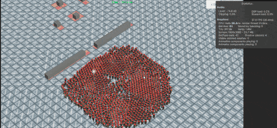

# DOTS-RTS — 大规模 RTS 群体模拟


## 📺 [Demo 视频（Bilibili）](https://www.bilibili.com/video/BV1moUhBsE3K/) （旧版）

---

基于 **Unity DOTS**（ECS + Jobs + Burst）的大规模 RTS 群体模拟系统。以 RTS 高密度单位移动作为实际压力测试场景，自下而上实现从玩法指令到物理求解的完整管线：

```
玩法指令 → 流场寻路 → 预测接触分类 → 软避让 → XPBD 约束求解 → ECS 写回
```

---

## 核心特性

### 1. 流场寻路（Flow Field Pathfinding）

摒弃逐单位 A*，基于 **Eikonal 方程**生成全局向量场：

- Cost Field（静态障碍代价）→ Integration Field（Eikonal BFS）→ Vector Field（8 方向梯度下降）
- 单位方向查询 O(1)，路径规划完全并行化（Job System + Burst）
- 双缓冲 Grid / PendingGrid，目标变更时按需重烘焙


---

### 2. 增量预测接触管线（Incremental Predictive Contact Pipeline）

针对 RTS 场景中相邻帧接触拓扑高度相干的特点，维护**跨帧持久候选状态**，只对变化的"脏 body"进行增量修补。

**持久拓扑：**
- `StableEntityPairKey` 驱动实体对生命周期：`Dormant → Approaching → Predictive → Actual → Separating → Expired`
- `PersistentSweptProxy` 以 Guard Bounds 证明候选集拓扑完备性
- `NativeHashMap<StableEntityPairKey, PersistentPredictiveContact>` 提供 O(1) 持久接触查找，消除 sort + binary search 热路径

**增量修补决策：**
- 每帧验证代理有效 → 标记脏体（拓扑脏 / 几何脏 / 逃逸）
- `dirtyRatio > 35%` 全量回退，否则增量修补脏 body 的邻居对
- 软避让输出强制钳位在已证明的 Interaction Envelope 内；逃逸时二分搜索最大安全缩放因子

**独立验证：**
- O(N²) Oracle 持续检测增量管线的漏报（False Negative），`RTS_CONTACT_DIAGNOSTICS` 模式下漏报计数必须为零

**1k 单位 — Substep 缓存关闭 / 开启对比：**

> **实测结果：** 在相同 1k 单位场景与参数下，启用 Substep 缓存后，整体求解管线耗时降低约 **60%**。

<table>
  <tr>
    <th align="center">Substep 缓存关闭</th>
    <th align="center">Substep 缓存开启</th>
  </tr>
  <tr>
    <td></td>
    <td></td>
  </tr>
</table>

---

### 3. Timestep Contact Set（跨子步接触视图缓存）

`EnableTimestepContactSetCache` 开启后，首个子步完成接触分类并缓存完整 `TimestepContactPairs` 视图；后续子步直接复用，避免每子步重跑 Swept Disc BroadPhase + 分类。

当单位轨迹偏出 Guard Envelope（包络逃逸）时，Certifier 对受影响 body 执行**增量修复（Incremental Repair）**：仅重分类脏 body 的邻居对，未受影响的接触对保持不变。脏比例超阈值或修复失败时回退全量重建。

`EnablePersistentContactCache` 进一步跨 timestep 保留接触生命周期与激活时序，使 Dormant 接触在预计到达子步时直接激活，无需每帧从零分类。

---

### 4. XPBD + 软避让

- **软分离（Soft Avoidance）：** 支持 Surface Velocity Buffer 与 RVO 两种模式，消耗紧凑 Soft 视图（非全量邻居）
- **硬约束投影（Hard Constraint）：** XPBD 位置投影修正穿透，含 Compliance 柔度控制，支持 Regular 与 Predictive 两种接触模式
- **墙壁约束：** 基于流场格阻挡的静态墙壁投影，防止单位穿入障碍格
---

### 5. 事件溯源回放（Event Sourcing Replay）

- **零快照：** 仅录制关键输入指令（Command Buffer），不存储每帧 Transform
- **瞬间重置：** 利用 ECS 结构特性，毫秒级状态回滚与指令重演
- 按 `L` 开始录制，按 `R` 开始回放


---

### 6. 混合式网络架构

- 基于 **Unity NetCode for Entities**，服务端权威 + 客户端预测
- `NetCodeUnitFlowMovementSystem`（联网）与 `LocalUnitFlowMovementSystem`（本地）共享同一 `BaseFlowMovementSystem` 调度逻辑

---

## 技术架构

### Pipeline 分层

```
Runtime/ContactPipeline/
├── Contracts/
│   ├── Body/              # 单 timestep body 数据产品
│   ├── Certification/     # InteractionCertificate、违规类型
│   ├── Execution/         # ContactPipelineConfiguration（不可变快照）
│   └── Interaction/       # BodyPair, ContactConstraint, 代理/调度条目
├── State/
│   ├── Persistent/        # 跨帧候选所有者（InteractionCandidateStore）
│   └── Frame/             # 帧生命周期资源所有者
├── Kernels/               # 无容器共享 Burst 算法（分类器、调度器、数学）
├── Scheduling/
│   ├── CrowdContactPipelineScheduler.cs
│   └── Parallel/
│       ├── ParallelContactPipelineScheduler.cs
│       └── Jobs/          # 可执行并行 Job（Jacobi / 逃逸计数 / Scatter / Gather）
├── Stages/
│   ├── Certification/     # BroadPhase / Persistent / Prediction / Validation
│   ├── Lifecycle/
│   ├── SoftAvoidance/
│   ├── Motion/
│   └── Solver/            # XPBD（Gauss-Seidel / Jacobi）、墙壁、CSR Incident Index
│       └── Observability/ # 编译期诊断捕获（RTS_CONTACT_DIAGNOSTICS）
└── Observability/
    └── Contracts/         # 观测数据 ABI，不参与正确性
```

### 数据流

```
玩法指令（UnitMoveInputSystem）
        │  框选 → MoveOrder
        ▼
RtsCommandSystem — 编队槽位分配 → UnitMoveDestination
        │
        ▼
FlowFieldBakeSystem — Cost → Integration → Vector（按需重烘焙）
        │
        ▼
BaseFlowMovementSystem（每帧）
  ├─ [初始化]    CalculateIndependentFlowForceJob
  ├─ [认证]     IncrementalPredictiveContactPipeline
  │              ↳ 持久拓扑验证 / 增量修补 / 全量回退
  │              ↳ InteractionCertificate 签发，下游消费受证书守护
  └─ for each substep
       ├─ [SoftAvoidance]  RVO / 速度缓冲
       ├─ [Motion]         速度整合 → 预测位置
       └─ for each iteration
            ├─ [Wall]      墙壁约束投影
            └─ [Contact]   XPBD pair 评估 → body gather
  └─ ApplyFlowMovementJob — Transform + Velocity 写回 ECS
```

**架构约束（CI 强制执行）：**
- `BaseFlowMovementSystem` 是唯一组合根，不实现分类、证书、求解器或诊断算法
- 持久候选状态仅 Certifier 可写；SoftAvoidance / Motion / Solver 只消费已签发的认证视图
- `RTS_CONTACT_DIAGNOSTICS` 关闭时零额外 NativeContainer、零额外 Job、零 Profiler 读取
- Oracle 可观测但不可改变候选状态或签发证书

---

## 性能演示

**5k 单位同屏运行：**

<!-- 待补：5k 单位运行截图 -->
<!--  -->

---

## 诊断工具

| 工具 | 入口 | 功能 |
|------|------|------|
| **SimulationDebuggerPanel** | `F8` 开关 | IMGUI 面板：概况 / 接触分类 / 增量统计 / 运行时参数覆盖 |
| **CSV 录制** | `F6` 开始/停止，`F7` 重置录制 | 按帧输出接触统计 CSV，用于参数调优分析 |
| **Validate Incremental Predictive Contact Pipeline** | `RTS/Diagnostics/Validate…` | 运行增量管线合规验证 |
| **Incremental Contact Benchmark Tuner** | `RTS/Diagnostics/Incremental Contact Benchmark Tuner` | 自动参数搜索 + CSV 结果对比 |
| **Incremental Contact Pipeline** | `RTS/Diagnostics/Incremental Contact Pipeline` | 增量管线指标实时监控 |
| **Select Build Settings** | `RTS/Diagnostics/Select Build Settings` | 切换 `RTS_CONTACT_DIAGNOSTICS` 编译开关 |
| **Local Gameplay Mode Validation** | `RTS/Validation/Local Gameplay Mode` | 本地模式功能验证 |

`RTS_CONTACT_DIAGNOSTICS` 关闭时，所有诊断路径由预处理器移除；仿真正确性（证书、逃逸修复、全量回退）不受影响。

---

## CI 静态合约

`.github/workflows/` 四条 Python 脚本在每次 push 时静态检查：

| 脚本 | 检查内容 |
|------|---------|
| `validate_contact_architecture.py` | 层所有权；禁止历史 `Jobs/ContactPipeline` 布局回归 |
| `validate_contact_diagnostics.py` | 诊断关闭合约；零额外 container / job / profiler |
| `validate_contact_pipeline_audit.py` | 禁止 aggregate bag；调度器不可实现算法 |
| `validate_contact_static_contracts.py` | 调度步骤身份不可从缓存 generation 派生；Oracle 不写游戏状态 |

CI 不替代 Unity Editor 编译、Burst 编译、Collections Safety 和运行时性能验证。

---

## 已知限制

- Contact Island 休眠未实现——持续活跃接触始终参与求解
- Gauss-Seidel 无并行路径（需图着色或冲突无关批次）
- 持久 Spatial Membership 依赖容量上限，超限回退全量扫描
- 流场为全局烘焙，未支持动态障碍局部增量更新
